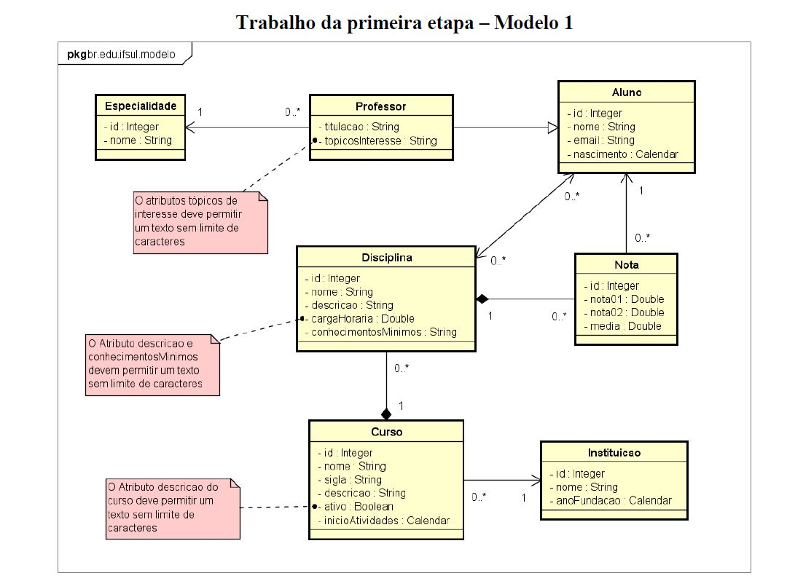

<h1 align="center">
  Sistema de Gerenciamento de Cursos
</h1>

## 💻 Detalhes do projeto

O sistema foi desenvolvido durante um trabalho para a faculdade no ano de 2017. O projeto que tem por objetivo disponibilizar um sistema onde seja possível fazer o controle de cursos de uma universidade, cadastrando alunos, especialidades de professores, disciplinas e cursos. O modelo de entidade relacionamento foi a base para o desenvolvimento do projeto.
<h1 align="center">
    
</h1>

## :grey_question: Sobre esse projeto

Feito com objetivo de aprimorar as habilidades de interpretação e resoluções de problemas conforme solicitado na elaboração do projeto. Essa é parte de negocios da aplicação.
Os arquivos do backend estão nesse repositório, para acessar o frontend clique em [Web](https://github.com/alexvieirasj/DAW-Modelo-1-Web.git)  

## :rocket: Tecnologias utilizadas no projeto

As tecnologias utilizadas no projeto foram:

- [Java 8](https://www.oracle.com/br/java/technologies/javase/javase8-archive-downloads.html)
- [PostgreSQL](https://jdbc.postgresql.org/changelogs/2017-08-01-42.1.4-release/)
- [Hibernate Validator](https://hibernate.org/orm/releases/4.2/)
- [Hibernate JPA](https://mvnrepository.com/artifact/org.hibernate.javax.persistence/hibernate-jpa-2.0-api)

## :package: Como utilizar o projeto

É preciso ter instalado no computador o [Git](https://git-scm.com) e o [Node.js](https://nodejs.org/) para clonar e executar o projeto. 
O projeto pode ser baixado com as linhas de comando ou no formato zip clicando no botão "Code" na opção "Download ZIP"

```bash

    # Clonar os repositórios
    $ git clone https://github.com/alexvieirasj/DAW-Modelo-1-Model.git
    $ git clone https://github.com/alexvieirasj/DAW-Modelo-1-Web.git

    # Criar o banco de dados local, mapeado no arquivo persistence.xml       
    $ jdbc:postgresql://localhost:5432/DAW-5N1-Modelo-1

    # Todas as bibliotecas + o projeto do model estão adicionados no projeto web

    # Abrir o projeto Web e executar via Netbeans, Intelij ou Eclipse
    
    # running on port 8091
```

## :memo: Licença

Este projeto está sob a MIT License. Acesso o arquivo [LICENSE](https://github.com/alexvieirasj/DAW-Modelo-1-Model/blob/master/LICENSE) para maiores detalhes.
